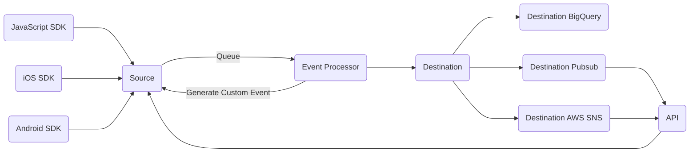

## Data Collection & Processing

## Data Sources

There are the ways to collect data into the system:

1. Web JavaScript SDK - installed on the website directly and it will send through the automatic events and custom events via dataLayer. Special logic is built in into the source. Sessions are maintained on the server side. For example, any `pageview` event will trigger the source to determine if a `session_start` event. And the UTM variables are attached to every subsequent event in the session. Due to the special logic, the source can only take in real-time events. Use the API source for non-real-time events.
2. API - this is designed to take in data from 1st party systems or 3rd party systems. Any system can send data to the system as JSON HTTP requests via the API source. The users need to write code to send the data.
3. iOS SDK - installed on the mobile apps directly to send data.
4. Android SDK - installed on the mobile apps directly to send data.

## Data Processing

N/A

## Data Destinations

These are the ways to store or use the data from the system:

1. BigQuery - this is a client GCP project BigQuery. The destination will automatically create the tables and maintain the views. Each event type will have its own view to make it simple to query the data. Each event type can contain 50 custom dimensions or metrics (number and currency) and the views will be automatically updated if the user update the custom dimension and metrics of the event.
2. GCP Pubsub
3. AWS SNS